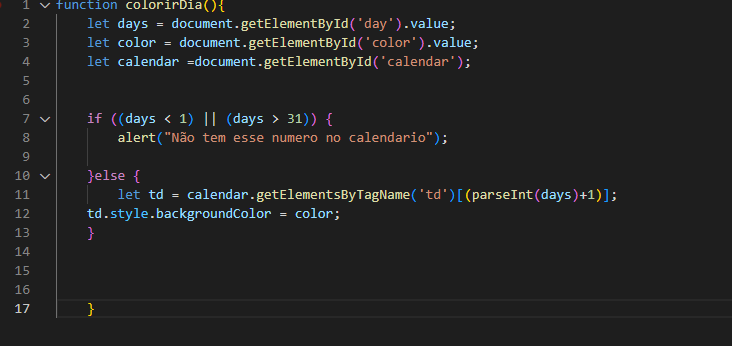
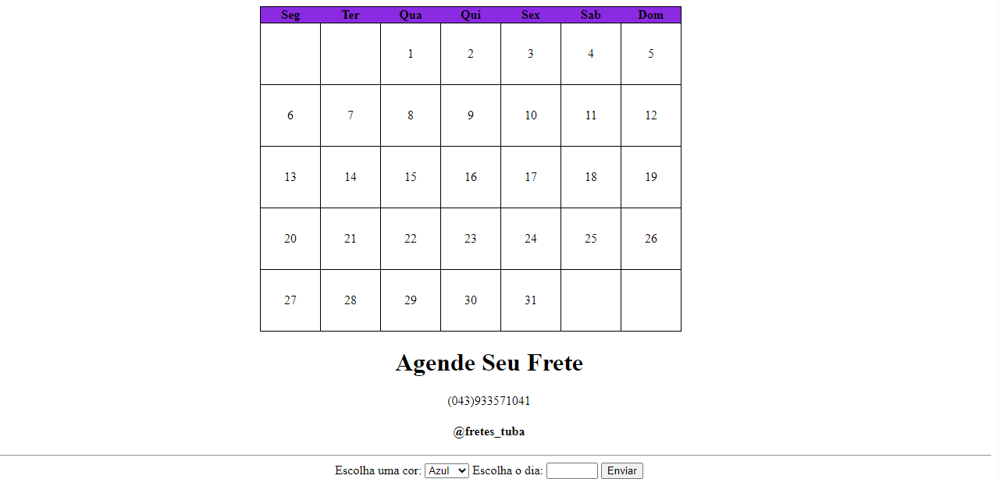

<h1 align="center">Calendario 📅</h1>

# Descrição do Projeto
* Esse projeto foi criado por um repositorio do Git Hub e tem um objetivo de organizar e agendar o seu frete através de um calendário.

# Tecnologias 
* HTML5;
* Javascript;
* CSS3;
* visual studio code;
* github;

### codigo java

# Funcionalidades 
* Esse projeto funciona para ajudar pessoas com agendamento para fretes.
* Facilitamento no processo de agendar fretes.
* Cores para identificar qual o veiculo.

# Introdução 
A área de agendamento de fretes da empresa Alpha enfrenta o desafio de otimizar o uso da frota de veículos, garantindo que cada veículo seja alocado de forma eficiente, respeitando as restrições de disponibilidade e capacidade de cada um. Para isso, desenvolvemos um sistema de calendário que permite o agendamento dos fretes de maneira intuitiva, dando um alerta na tela do usuário quando é digitado um número menor que 1 ou maior que 30 (ex: -5, -2, 0, 35, 40). Facilitando o trabalho dos colaboradores e garantindo o cumprimento das regras estabelecidas pela empresa.

